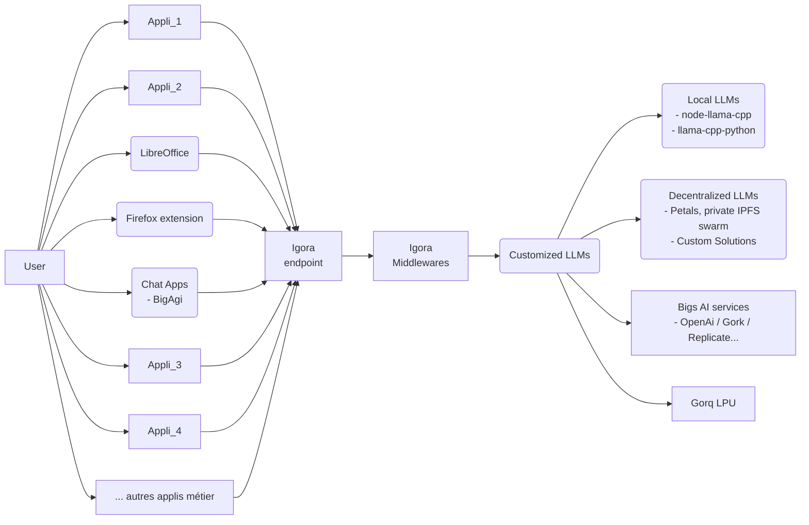
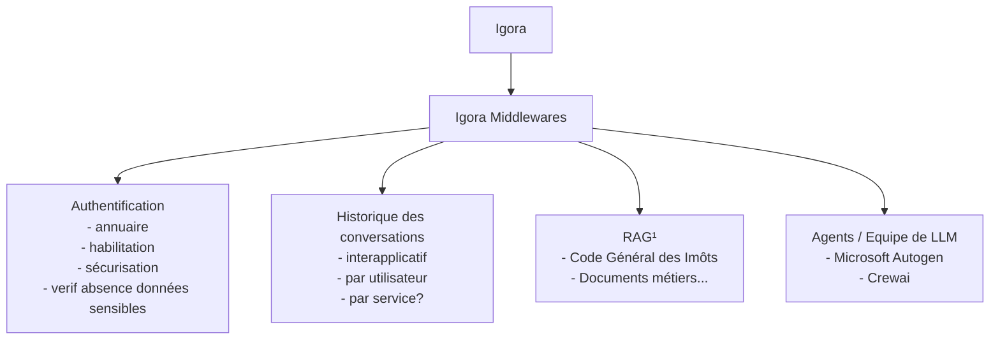
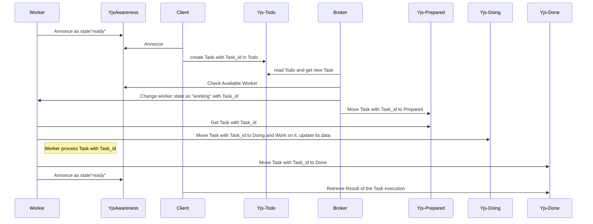

# Architecture générale Igora
- https://github.com/scenaristeur/igora

# Igora Middlewares (igora-reloaded)
- https://github.com/scenaristeur/igora-reloaded

¹ RAG : génération augmentée de récupération (retrieval-augmented generation)
- [Chroma](https://docs.trychroma.com/)
- [rag oracle](https://www.oracle.com/fr/artificial-intelligence/generative-ai/retrieval-augmented-generation-rag/)
- [rag postgres/ pgvector](https://medium.com/@yogi_r/retrieval-augmented-generation-rag-with-pgvector-vector-database-0d741e14d62f)

# Task Management
- synchronisation des tâches basée sur [Yjs](https://github.com/yjs/yjs/blob/main/README.md) / [Crdt](https://fr.wikipedia.org/wiki/Type_de_donn%C3%A9es_r%C3%A9pliqu%C3%A9_sans_conflit) à la façon d'un Kanban
- Yjs permet de synchroniser (via websocket) des objets javascripts "todos", "prepared", "doing", "done"
- chaque client peut modifier et écouter ces différents objets
- [Yjs Awareness](https://github.com/yjs/docs/blob/main/getting-started/adding-awareness.md) permet de connaître la présence des différents acteurs connectés
- Worker est un Worker LLM dont le rôle est d'executer l'inférence LLM (représenté par Customized LLMs sur le premier diagram). Le système peut utiliser plusieurs workers indépendants

