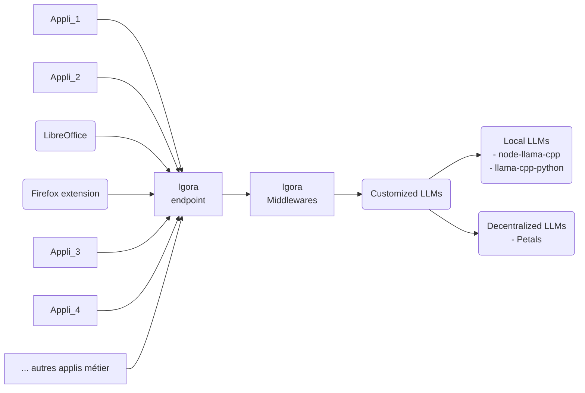
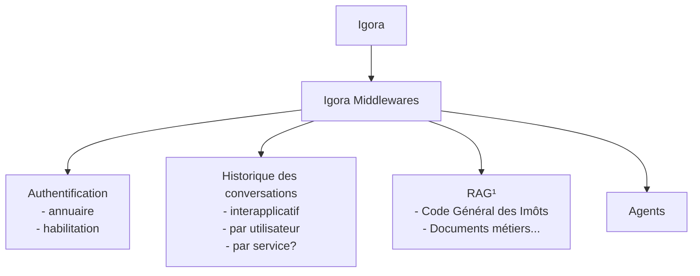

# Architecture générale Igora
- https://github.com/scenaristeur/igora

# Igora Middlewares (igora-reloaded)
- https://github.com/scenaristeur/igora-reloaded

¹ RAG : génération augmentée de récupération (retrieval-augmented generation)
- [Chroma](https://docs.trychroma.com/)
- [rag oracle](https://www.oracle.com/fr/artificial-intelligence/generative-ai/retrieval-augmented-generation-rag/)
- [rag postgres/ pgvector](https://medium.com/@yogi_r/retrieval-augmented-generation-rag-with-pgvector-vector-database-0d741e14d62f)
