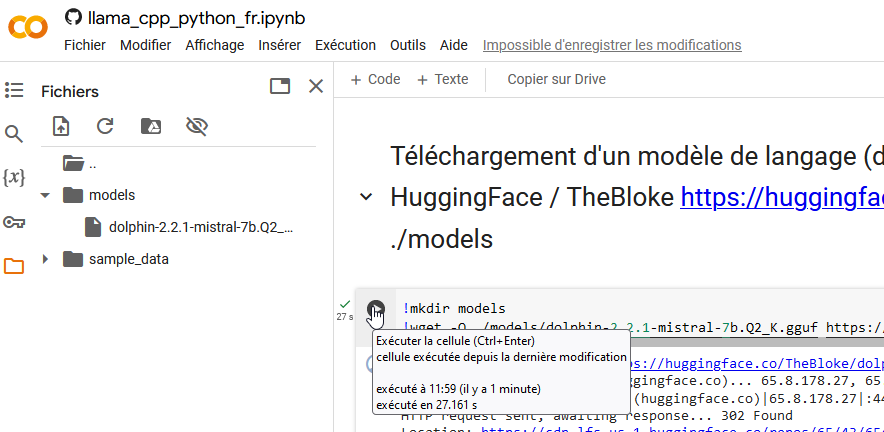

# Pour bien démarrer avec les LLM !

Pour bien comprendre de quoi on parle quand il est question d'**Intelligence Artificielle Générative**
et pour appréhender au mieux les LLM (Large Modèle de Langage), nous allons procéder en 3 étapes
que vous pouvez suivre sur [](https://colab.research.google.com/github/scenaristeur/igora/blob/main/notebooks/llama_cpp_python_fr.ipynb)

> sur google colab, les commandes "système" sont précédées par un point d'exclamation.


- 1 Téléchargement d'un modèle de langage (dolphin)
- 2 Installation d'un moteur d'inférence (llama-cpp-python)
- 3 Interrogation du modèle de langage via le moteur d'inférence (Nomme les planètes du système solaire)

## 1 Téléchargement d'un modèle de langage (dolphin)
Commençons par créer un dossier "models"
```
mkdir ./models
```
Nous pouvons maintenant télécharger un modèle de langage. 

Commençons avec un "petit" modèle de langage, Dolphin, basé sur Mistral dont on peut trouver la description sur HuggingFace https://huggingface.co/TheBloke/dolphin-2.2.1-mistral-7B-GGUF

Sur la page de téléchargement https://huggingface.co/TheBloke/dolphin-2.2.1-mistral-7B-GGUF/tree/main, il existe plusieurs versions Q2, Q3... qui correspondent à la "compression" ou [quantization](https://inside-machinelearning.com/quantization-tensorflow/) du modèle 

On peut télécharger ce modèle dolphin-2.2.1-mistral-7B-GGUF avec wget

```
!wget -O ./models/dolphin-2.2.1-mistral-7b.Q2_K.gguf https://huggingface.co/TheBloke/dolphin-2.2.1-mistral-7B-GGUF/resolve/main/dolphin-2.2.1-mistral-7b.Q2_K.gguf?download=true
```

C'est la première cellule dans le Google colab et vous pouvez l'executer en cliquant 




Si tout ce passe bien, vous devriez maintenant voir dans les fichiers locaux de votre colab [](https://colab.research.google.com/github/scenaristeur/igora/blob/main/notebooks/llama_cpp_python_fr.ipynb) votre modèle.


## 2 Installation d'un moteur d'inférence (llama-cpp-python)
Pour le moteur d'inférence, on va utiliser [llama-cpp-python](https://llama-cpp-python.readthedocs.io/en/latest/) simplement avec la commande :

```
pip install llama-cpp-python[server] --extra-index-url https://abetlen.github.io/llama-cpp-python/whl/cpu
```

Comme précédemment vous pouvez la lancer dans Colab en cliquant sur le triangle correspondant à la cellule.


## 3 Interrogation du modèle de langage via le moteur d'inférence (Nomme les planètes du système solaire)
La dernière étape est d'implémenter un tout petit code pour 
- importer notre moteur d'inférence(llama-cpp) `from llama_cpp import Llama`
- en utilisant ce moteur d'inférence, on créé notre llm
```
llm = Llama(
      model_path="./models/dolphin-2.2.1-mistral-7b.Q2_K.gguf"
)
```
- et on interroge notre llm en lui passant la question à laquelle on souhaite qu'il réponde, puis on affiche la réponse
```
output = llm(
      "Q: (Nomme les planètes du système solaire). A: ", # Prompt
      max_tokens=150, # Generate up to 32 tokens, set to None to generate up to the end of the context window
      stop=["Q:", "\n"], # Stop generating just before the model would generate a new question
      echo=True # Echo the prompt back in the output
) # Generate a completion, can also call create_completion
print(output)
```

Le code complet nous donne donc 
```
from llama_cpp import Llama
llm = Llama(
      model_path="./models/dolphin-2.2.1-mistral-7b.Q2_K.gguf",
      # n_gpu_layers=-1, # Uncomment to use GPU acceleration
      # seed=1337, # Uncomment to set a specific seed
      # n_ctx=2048, # Uncomment to increase the context window
)
output = llm(
      "Q: (Nomme les planètes du système solaire). A: ", # Prompt
      max_tokens=150, # Generate up to 32 tokens, set to None to generate up to the end of the context window
      stop=["Q:", "\n"], # Stop generating just before the model would generate a new question
      echo=True # Echo the prompt back in the output
) # Generate a completion, can also call create_completion
print(output)
reponse = output['choices'][0]["text"]
print("\nRéponse", reponse)
```

Et le résultat : 
```
{'id': 'cmpl-f517be80-5ad2-4955-8535-e4e8863e0358', 'object': 'text_completion', 'created': 1714385686, 'model': './models/dolphin-2.2.1-mistral-7b.Q2_K.gguf', 'choices': [{'text': 'Q: (Nomme les planètes du système solaire). A:  Les planètes du système solaire sont:', 'index': 0, 'logprobs': None, 'finish_reason': 'stop'}], 'usage': {'prompt_tokens': 20, 'completion_tokens': 12, 'total_tokens': 32}}

Réponse Q: (Nomme les planètes du système solaire). A: 1. Mercure 2. Vénus 3. La Terre 4. Mars 5. Jupiter 6. Saturne 7. Uranus 8. Neptune
```


Et voilà, vous avez implémenté votre premier LLM et vous pouvez l'utiliser, changer la question...

Evidemment, il existe des tonnes de paramètres, de personnalisation pour leur demander des choses plus précises, orienter votre llm en lui imposant une façon d'agir avec un "prompt système"...
