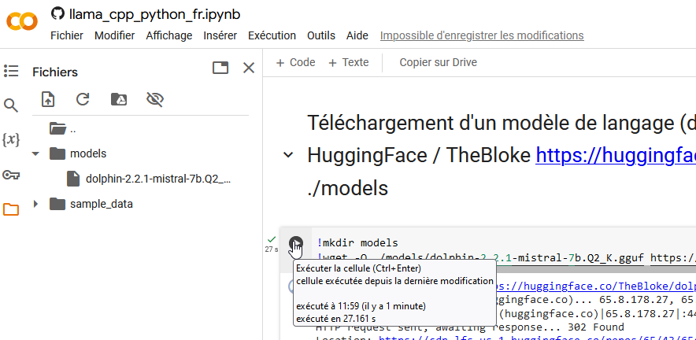

# Pour bien démarrer avec les LLM

Pour bien comprendre de quoi on parle quand il est question d'**Intelligence Artificielle Générative**
et pour appréhender au mieux les LLM (Large Modèle de Langage), nous allons procéder en 3 étapes
que vous pouvez suivre sur [](https://colab.research.google.com/github/scenaristeur/igora/blob/main/notebooks/llama_cpp_python_fr.ipynb)

> sur google colab, les commandes "système" sont précédées par un point d'exclamation.


- 1 Téléchargement d'un modèle de langage (dolphin)
- 2 Installation d'un moteur d'inférence (llama-cpp-python)
- 3 Interrogation du modèle de langage via le moteur d'inférence (Nomme les planètes du système solaire)

## 1 Téléchargement d'un modèle de langage (dolphin)
Commençons par créer un dossier "models"
```
mkdir ./models
```
Nous pouvons maintenant télécharger un modèle de langage. 

Commençons avec un "petit" modèle de langage, Dolphin, basé sur Mistral dont on peut trouver la description sur HuggingFace https://huggingface.co/TheBloke/dolphin-2.2.1-mistral-7B-GGUF

Sur la page de téléchargement https://huggingface.co/TheBloke/dolphin-2.2.1-mistral-7B-GGUF/tree/main, il existe plusieurs versions Q2, Q3... qui correspondent à la "compression" ou [quantization](https://inside-machinelearning.com/quantization-tensorflow/) du modèle 

On peut télécharger ce modèle dolphin-2.2.1-mistral-7B-GGUF avec wget

```
!wget -O ./models/dolphin-2.2.1-mistral-7b.Q2_K.gguf https://huggingface.co/TheBloke/dolphin-2.2.1-mistral-7B-GGUF/resolve/main/dolphin-2.2.1-mistral-7b.Q2_K.gguf?download=true
```

C'est la première cellule dans le Google colab et vous pouvez l'executer en cliquant 




Si tout ce passe bien, vous devriez maintenant voir dans les fichiers locaux de votre colab [](https://colab.research.google.com/github/scenaristeur/igora/blob/main/notebooks/llama_cpp_python_fr.ipynb) votre modèle.


## 2 Installation d'un moteur d'inférence (llama-cpp-python)
Pour le moteur d'inférence, on va utiliser [llama-cpp-python](https://llama-cpp-python.readthedocs.io/en/latest/) simplement avec la commande :

```
pip install llama-cpp-python[server] --extra-index-url https://abetlen.github.io/llama-cpp-python/whl/cpu
```

Comme précédemment vous pouvez la lancer dans Colab en cliquant sur le triangle correspondant à la cellule.


## 3 Interrogation du modèle de langage via le moteur d'inférence (Nomme les planètes du système solaire)
La dernière étape est d'implémenter un tout petit code pour 
- importer notre moteur d'inférence(llama-cpp) `from llama_cpp import Llama`
- en utilisant ce moteur d'inférence, on créé notre llm
```
llm = Llama(
      model_path="./models/dolphin-2.2.1-mistral-7b.Q2_K.gguf"
)
```
- et on interroge notre llm en lui passant la question à laquelle on souhaite qu'il réponde, puis on affiche la réponse
```
output = llm(
      "Q: (Nomme les planètes du système solaire). A: ", # Prompt
      max_tokens=150, # Generate up to 32 tokens, set to None to generate up to the end of the context window
      stop=["Q:", "\n"], # Stop generating just before the model would generate a new question
      echo=True # Echo the prompt back in the output
) # Generate a completion, can also call create_completion
print(output)
```

Le code complet nous donne donc 
```
from llama_cpp import Llama
llm = Llama(
      model_path="./models/dolphin-2.2.1-mistral-7b.Q2_K.gguf",
      # n_gpu_layers=-1, # Uncomment to use GPU acceleration
      # seed=1337, # Uncomment to set a specific seed
      # n_ctx=2048, # Uncomment to increase the context window
)
output = llm(
      "Q: (Nomme les planètes du système solaire). A: ", # Prompt
      max_tokens=150, # Generate up to 32 tokens, set to None to generate up to the end of the context window
      stop=["Q:", "\n"], # Stop generating just before the model would generate a new question
      echo=True # Echo the prompt back in the output
) # Generate a completion, can also call create_completion
print(output)
reponse = output['choices'][0]["text"]
print("\nRéponse", reponse)
```

Et le résultat : 
```
{'id': 'cmpl-f517be80-5ad2-4955-8535-e4e8863e0358', 'object': 'text_completion', 'created': 1714385686, 'model': './models/dolphin-2.2.1-mistral-7b.Q2_K.gguf', 'choices': [{'text': 'Q: (Nomme les planètes du système solaire). A:  Les planètes du système solaire sont:', 'index': 0, 'logprobs': None, 'finish_reason': 'stop'}], 'usage': {'prompt_tokens': 20, 'completion_tokens': 12, 'total_tokens': 32}}

Réponse Q: (Nomme les planètes du système solaire). A: 1. Mercure 2. Vénus 3. La Terre 4. Mars 5. Jupiter 6. Saturne 7. Uranus 8. Neptune
```


## Bravo!!!, 
vous avez implémenté votre premier LLM et vous pouvez l'utiliser, par exemple en changeant la question 

> **"Q: (Nomme les planètes du système solaire). A: "**

Evidemment, il existe des tonnes de paramètres, de personnalisation pour leur demander des choses plus précises, orienter votre llm en lui imposant une façon d'agir avec un "prompt système"...
